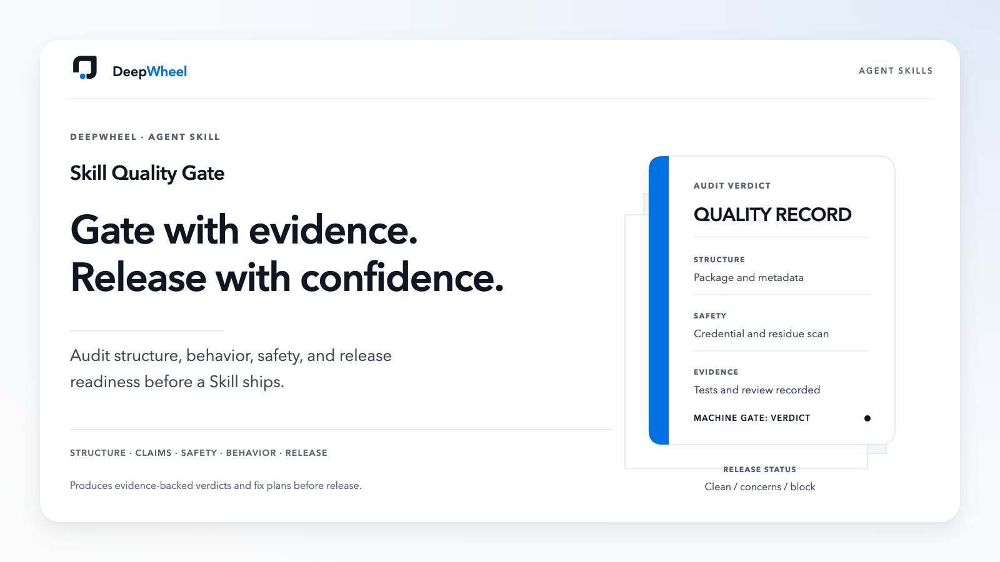
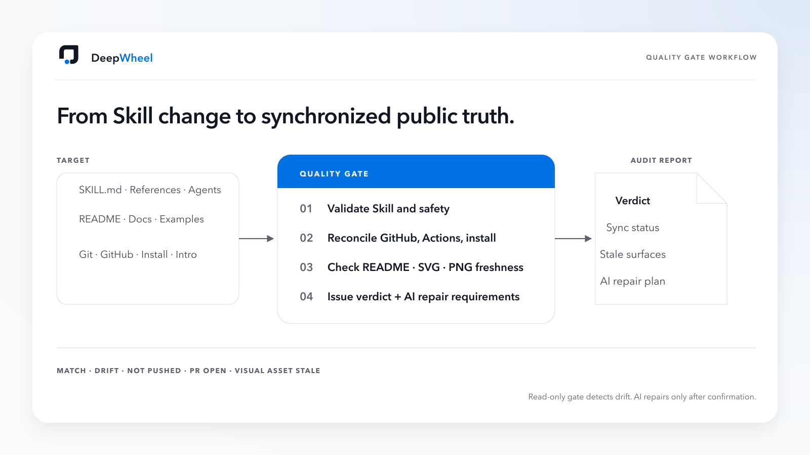

# Lucas-DeepWheel Skill Quality Gate

Status: private-repository release candidate; not publicly published.



## What it does

Skill Quality Gate audits an Agent Skill and, optionally, its publication package before installation or release.

The default publication-file baseline is designed for Lucas-DeepWheel family repositories. Third-party Skills may need a tailored baseline instead of treating family-specific file omissions as release blockers.

It checks:

- structure and frontmatter;
- capability claims and adjacent-task boundaries;
- independent product entry and companion-Skill routing;
- new-user capability preflight;
- token and interaction policies;
- common credential shapes, local paths, PII, and raw residue;
- GitHub publication readiness;
- whether machine findings can correctly block CI.

It does not execute the target Skill's business actions and does not replace real behavior tests or human review.



## Quick Start

Audit a Skill folder:

```bash
python3 skills/lucas-deepwheel-skill-quality-gate/scripts/skill_quality_gate.py /path/to/target-skill
```

Audit both the Skill and its publication package:

```bash
python3 skills/lucas-deepwheel-skill-quality-gate/scripts/skill_quality_gate.py /path/to/target-skill --publication-dir /path/to/publication-package
```

Exit codes are stable for automation:

- `0`: CLEAN;
- `1`: CONCERNS;
- `2`: BLOCK or invalid requested path.

The report names the risk category and relative file only. It does not echo matched credentials or machine-specific absolute paths.

## Capability boundary

### Supported

- Static Skill and publication-package audit.
- Safe JSON or human-readable output.
- CI-blocking exit semantics.
- Seven-role review guidance and P0/P1/P2 repair planning.

### Requires tools or human review

- Real behavior smoke tests.
- HTML, PPT, PDF, OCR, video, audio, or image-generation tests.
- Copyright, customer privacy, supply-chain, and release decisions.
- Cross-platform installation and rollback tests.

### Not promised

- Complete secret or PII detection.
- Proof that all business capabilities work.
- Automatic repair, installation, publishing, push, Tag, or Release.
- Replacement for a security review.

## Installation

Preview the safe local installation from the repository root:

```bash
python3 scripts/install-local.py
```

The default invocation is a dry run. It does not create or replace files. Read [docs/INSTALLATION.md](docs/INSTALLATION.md) before any `--apply` action.

## Validation

```bash
python3 scripts/validate-version.py
python3 scripts/validate-lucas-deepwheel-skill.py skills/lucas-deepwheel-skill-quality-gate .
python3 scripts/validate-lucas-deepwheel-quality-gate.py skills/lucas-deepwheel-skill-quality-gate .
python3 -m unittest discover -s tests -p 'test_skill_quality_gate.py' -v
```

## Security

See [SECURITY.md](SECURITY.md). Never place credentials, private customer material, complete sensitive logs, or real protected assets in examples, tests, issues, or reports.

## Contributing

See [CONTRIBUTING.md](CONTRIBUTING.md). Changes to scanner behavior must include positive and negative tests.

## License

MIT License. See [LICENSE](LICENSE).
