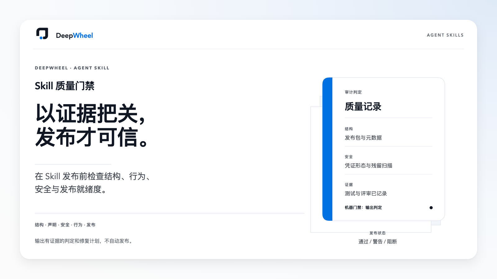
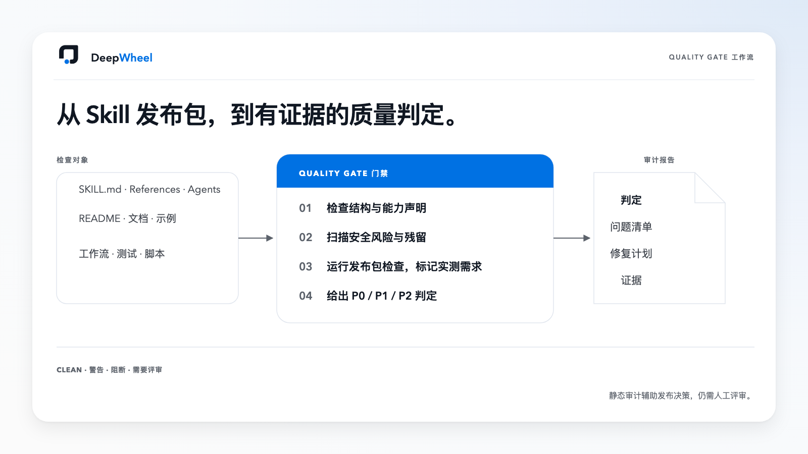

# Lucas-DeepWheel Skill Quality Gate｜Skills 质量门禁

[English](README.md) | **简体中文**

状态：公开发布候选版；当前版本 0.1.0-rc.3。



## 一句话理解

Skill Quality Gate 用于在安装或发布前检查一个 Agent Skill，以及可选的 GitHub 发布包。

默认发布文件基线面向 Lucas-DeepWheel 家族仓库。检查第三方 Skill 时，应先定制适合它的基线，不把家族专属文件缺失直接当成发布阻断。

它会检查：

- 结构与 frontmatter；
- 能力声明和相邻任务边界；
- 独立产品入口与关联 Skill 路由；
- 新用户能力体检；
- Token 与交互策略；
- 常见凭证形状、本机路径、个人信息和原始残留；
- GitHub 发布准备；
- 机器门禁是否能用退出码真正阻断 CI。

它不执行目标 Skill 的业务动作，也不替代真实行为测试和人工判断。



## 快速开始

检查 Skill 文件夹：

```bash
python3 skills/lucas-deepwheel-skill-quality-gate/scripts/skill_quality_gate.py /path/to/target-skill
```

同时检查 Skill 与发布包：

```bash
python3 skills/lucas-deepwheel-skill-quality-gate/scripts/skill_quality_gate.py /path/to/target-skill --publication-dir /path/to/publication-package
```

高风险专业签核前，先生成确定性的 Skill 指纹，并与 `Status: APPROVED` 一起记录：

```bash
python3 skills/lucas-deepwheel-skill-quality-gate/scripts/skill_quality_gate.py /path/to/target-skill --print-skill-sha256
```

稳定退出码：

- `0`：CLEAN；
- `1`：CONCERNS；
- `2`：BLOCK 或指定路径无效。

报告只输出风险类别和相对文件名，不回显匹配到的凭证，也不暴露目标机器绝对路径。

## 能力边界

### 已支持

- Skill 本体和发布包的静态审计；
- 安全的 JSON 或人类可读输出；
- 可阻断 CI 的退出码；
- 7 角色评审指引和 P0/P1/P2 修复规划。

### 需要工具或人工复核

- 真实行为 smoke test；
- HTML、PPT、PDF、OCR、视频、音频或生图测试；
- 版权、客户隐私、供应链和发布决策；
- 跨平台安装与回滚测试。

### 暂不承诺

- 检出所有凭证或个人信息；
- 证明全部业务能力可用；
- 自动修复、安装、发布、push、Tag 或 Release；
- 替代正式安全审查。

## 安装

在仓库根目录先预览安全安装：

```bash
python3 scripts/install-local.py
```

默认只做预检，不创建、不替换文件。执行任何 `--apply` 动作前，请先阅读 [docs/INSTALLATION.md](docs/INSTALLATION.md)。

## 本地校验

```bash
python3 scripts/validate-version.py
python3 scripts/validate-lucas-deepwheel-skill.py skills/lucas-deepwheel-skill-quality-gate .
python3 scripts/validate-lucas-deepwheel-quality-gate.py skills/lucas-deepwheel-skill-quality-gate .
python3 -m unittest discover -s tests -p 'test_skill_quality_gate.py' -v
```

## 安全

见 [SECURITY.md](SECURITY.md)。不要把凭证、私密客户资料、完整敏感日志或真实受保护资产放入示例、测试、Issue 或报告。

## 贡献

见 [CONTRIBUTING.md](CONTRIBUTING.md)。修改扫描逻辑时必须同时补正向和负向测试。

## License

MIT License，见 [LICENSE](LICENSE)。

## 高风险领域门禁

当 Skill 入口涉及健康、医疗、基因、营养、法律、财务等高风险领域时，必须提供 agents/risk-profile.json。风险档案必须声明领域、敏感数据，以及同意、人工复核、来源追溯和拒绝规则；缺失或低报风险将直接 BLOCK。

机器门禁能验证风险档案字段和入口中的控制条款是否存在，但不能证明专业规则本身正确；高风险 Skill 仍必须经过领域专家和人工行为测试。

高风险公开包只要启用了个体化数值建议，专业签核缺失、待定或指纹失效都直接判定 BLOCK。明确关闭个体化数值、仅供教育参考的候选版，在完成专业签核前保持 CONCERNS。免责声明不能解锁数值能力。
